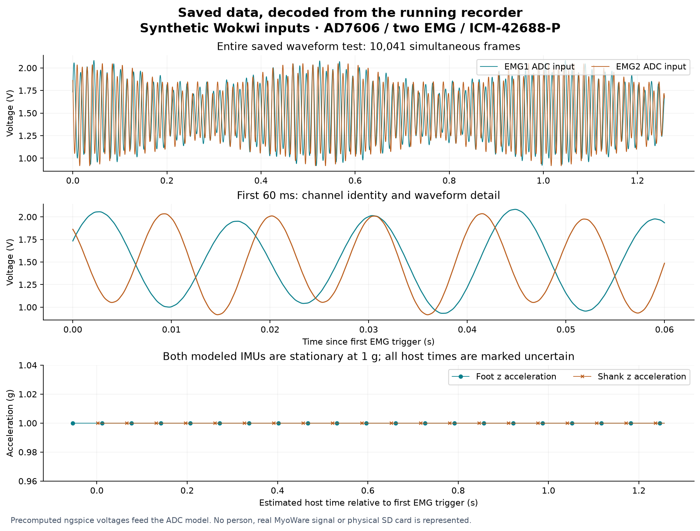

# Read and interpret a saved recording

Muttakin Rahman · AD7606 / two EMG / ICM-42688-P · 3 October 2026

**The integrated recorder saves interpretable data.** Two captured Wokwi runs were independently checked against their original binary records, known inputs and exported CSV files. Every one of their **21,116 records** passes CRC32 and matches its CSV row. This verifies storage and interpretation within the simulator; the recordings are synthetic.

[Download the example recordings and CSVs](../simulations/recording-interpretation/recording-examples.zip) · [Independent audit results](../simulations/recording-interpretation/results.json) · [Digital timing verification](digital-timing.html) · [Complete recorder](whole-system.html)

## What is actually saved

Each example is **679,808 bytes**: a 4,096-byte versioned metadata header followed by 10,558 fixed-size, 64-byte records. Each header and record has its own CRC32. The firmware's FatFS writes, syncs and closes the file on a **PSRAM-backed substitute medium**. No physical microSD card or SDMMC transfer is tested here.

| Stream | Records in each run | Stored information |
|---|---:|---|
| EMG | 10,041 simultaneous frames | EMG1 and EMG2 signed ADC codes, conversion-trigger host time, sequence, read timing, enabled-channel mask and fault flags |
| Foot IMU | 263 | Original ICM FIFO packet, six axes, sensor timestamp, estimated host time, IRQ anchor and FIFO read interval |
| Shank IMU | 252 | The same fields, identified as a separate sensor stream |
| Status | 1 | Sample counters, missed slots, queue drops, ADC/IMU errors and simulated battery state |
| Session end | 1 | Final counters and stop reason; distinguishes a completed session from an interrupted file |

The foot sensor starts earlier than the shank sensor. Its first estimated time is 875,001 µs; the shank starts at 930,002 µs. Eleven additional foot packets belong to startup. Both have 252 interrupt events within the ADC acquisition window in the complete-scene pin capture. The differing file counts are explained, rather than silently filled or truncated.

## Open the files

Extract the example download. Each of `examples/known-dc/` and `examples/synthetic-waveform/` contains:

| File | Purpose |
|---|---|
| `recorder-output.raw` | Exact bytes exported by the executing firmware; retained unchanged as evidence |
| `simulated-recording.afolog` | Analysis copy with an explicitly synthetic header; all measurement-record bytes are identical to the original |
| `converted/emg.csv` | Both enabled EMG channels, ADC codes, volts and timing |
| `converted/foot.csv`, `shank.csv` | Sensor axes in raw counts, g and degrees per second, with timing qualifications |
| `converted/status.csv` | Health counters and session stop state |
| `converted/metadata.json` | ADC, range, channel identities, nominal scaling, firmware, timing method and calibration state |
| `converted/quality.json` | Completeness, CRC source identity, detected gaps, anomalies and timing limitations |
| `analysis/muscle.csv`, `foot-motion.csv`, `shank-motion.csv` | Convenient named columns and seconds relative to the first EMG trigger; no filtering or resampling |
| `live-capture/*.afolog`, `live-results.json` | Best-effort preview archive and its separately reported gap |

Open CSVs in Excel, MATLAB, Python or R. **Read `quality.json` and `metadata.json` first.** The convenient analysis tables retain fault flags and negative startup times; they do not repair or synchronize data.

The normal firmware header says `synthetic=false`, even when that image executes in Wokwi. The evidence exporter changes only `synthetic` and adds `simulation` in the analysis copy, recalculating the header CRC. It never edits a sample. The independently checked sidecars and manifests identify both files. Do not use the original header alone to decide whether data were measured on hardware.

## EMG voltage and channel identity

`ch0` means **EMG1**; `ch1` means **EMG2**, as recorded in metadata. Both codes belong to the same AD7606 conversion. The driver reads all eight words, but the remaining channels are not exported as muscle measurements. The two unused slots in the common four-channel record are zero and the enabled mask is `3`.

For the selected ±5 V range:

```text
ADC input voltage (V) = signed ADC code × 5 / 32768
Nominal resolution = 0.000152587890625 V per code
```

The known-voltage example stores code **6554 → 1.000061 V** on EMG1 and **13107 → 1.999969 V** on EMG2. These round-trip correctly through the actual recorder and converter. The CSV is in **volts at the ADC input**, not input-referred muscle microvolts, force, activation percentage or normalized EMG.

The selected analog circuit has unity nominal scaling, so `*_myoware_raw_v_estimate` currently equals the ADC-input voltage. `input_midpoint_mv=0` is the reconstruction offset. The unplugged-input **1.5 V bias** is recorded separately; do not subtract it as a calibrated electrode baseline. ADC reference, analog gain/offset and MyoWare gain have not been measured.

Blank `adc_status` and `adc_crc` columns are intentional: the original AD7606 has neither a sensor-frame status word nor a sensor CRC. File CRC32 detects damaged stored records; it does not prove that an unprotected ADC serial word was electrically correct.

## Motion axes and units

The metadata selects ±16 g acceleration and ±2000 degrees/s gyroscope ranges. Conversion preserves the sensor's FIFO axis order:

```text
Acceleration (g) = signed count × 16 / 32768
Angular velocity (degrees/s) = signed count × 2000 / 32768
```

Both models produce `az_raw=2048 → 1 g` and zero angular velocity. Tiny x-axis markers distinguish foot from shank: one count and two counts respectively. They are deliberate virtual identities, not measured motion. Temperature remains a raw count in this export. Sensor axes are not yet a calibrated anatomical or earth reference frame; mounting orientation must be measured before gait analysis.

## Which time should be used

EMG `conversion_trigger_host_us` uses the ESP32's monotonic **microseconds since boot**, associated with the CONVST software write. It is not UTC or a measured aperture time. For relative seconds, subtract the first EMG trigger and divide by 1,000,000. The example spans 1.257537 s between its first and last EMG triggers, with a timestamp-derived rate of **7,983.86 Hz**, inside the declared 8 kHz ±1% virtual gate. This short run does not establish long-term timing accuracy.

IMU `host_time_estimate_us` is reconstructed from a FIFO timestamp and interrupt timing; it is explicitly an estimate. `sensor_timestamp_raw` is the original 16-bit counter. `sensor_time_unwrapped_us` retains continuous sensor order across the 20 foot and 19 shank counter wraps in this short example. The two independent counters do not share an absolute clock origin.

All **515 IMU records** retain flag `2`, meaning timing uncertainty. A FIFO read interval describes a burst: later packets may be produced after its read starts or after its first IRQ anchor. The recorded read end bounds all nominal packet estimates here. Do not substitute `read_start_us` or `irq_anchor_us` for every packet's sample time. Drift and filter delay have not been calibrated; precision cross-sensor alignment still requires physical validation.

The convenience motion tables use the same first-EMG origin. Early foot samples therefore have negative relative time. This is intentional; no synchronization, interpolation or gap filling is performed.

## The saved waveform is visible



The second run feeds 8,000 precomputed ngspice samples into the behavioral ADC and repeats that one-second input sequence. Every saved EMG code matches the corresponding source sample, including the repetition. Maximum difference between the input voltage and decoded quantized voltage is **76.293 µV**, below half the nominal ADC step. This is ideal quantization evidence; it is not measured ENOB, sensor noise or ADC accuracy. The substitute op-amp model and offline analog coupling limits remain in the [stimulus description](../simulations/integrated-recorder/stimulus/summary.json).

## Saved data and live preview differ deliberately

In both examples the live archive omits **EMG sequence 5330** and reports one device preview drop. Every received measurement record is byte-identical to the corresponding saved record. The saved file contains sequence 5330 and has no detected sample loss. Use the saved file as the primary research archive and retain preview gap reports when using live data.

The existing fault runs also make incomplete data visible:

| Injected fault | Exported result |
|---|---|
| Queue overflow after a 350 ms writer stall | [One queue drop, counter mismatch and abnormal stop](../simulations/integrated-recorder/results/web-current/queue-stall-350ms/converted/quality.json); `no_detected_sample_loss=false` |
| Interrupted recording | [Missing END and final-counter mismatch](../simulations/integrated-recorder/results/web-current/interrupted-recording/converted/quality.json); `session_finalized=false` |
| Storage write error | [Partial recording without END](../simulations/integrated-recorder/results/web-current/storage-write-error/converted/quality.json); completeness fails |
| Missing foot interrupt | [Missing foot stream and IMU error](../simulations/integrated-recorder/results/web-current/imu-missing-interrupt/converted/quality.json); acquisition stops visibly |

A passing fault test means that the fault is reported correctly. It does not mean its recording is complete. `research_ready` remains false throughout these examples.

## Reproduce the comparison

The independent audit uses Python's standard library and does not import the existing converter. From the extracted example download:

```sh
python3 verify_saved_data.py --examples examples --output checked-results.json
python3 analyze_example.py examples/synthetic-waveform/converted my-analysis
```

The audit checks all original record CRCs, exact sample-body preservation, enabled-channel mask, unused slots, input code identity, every CSV field, units, sensor counter wraps, uncertain timing flags, final counters and live-to-saved byte parity. The [eleven damaged-data cases](../simulations/recording-interpretation/audit-tests.json) reject CRC damage, truncation, swapped channels, wrong units, hidden disabled columns, missing rows, altered IMU flags and counter mismatches. Source evidence remains unchanged.

For a new physical recording, use the package's existing [converter](../host/convert.py) and [recording/recovery guide](recording-verification.html). This example auditor intentionally expects these two specific synthetic sessions; it is not a general claim that arbitrary future recordings are valid.

Physical SD behavior, actual reference/scaling, MyoWare waveform quality, timing alignment, RF performance and long recordings remain unmeasured. The format is interpretable; research conclusions still depend on measured calibration, experimental labels and hardware validation.
