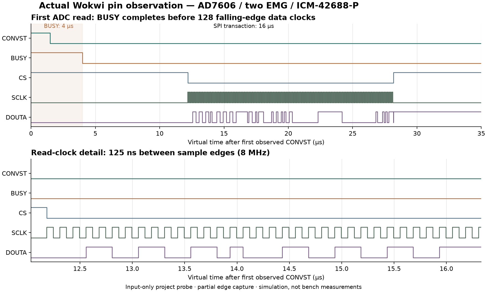

# Digital timing, observed in Wokwi

Muttakin Rahman · AD7606 / two EMG / ICM-42688-P · 3 October 2026

The complete recorder now has a separate **passing digital pin capture**. An input-only virtual probe watched the running ESP-IDF firmware and the modeled ADC/IMU signals. Its **10,041 conversion triggers and 10,041 reads** match the saved EMG frames exactly. The saved file, actual converter and live decoder also pass.

This check observes simulated digital behavior. Sensor physics, analog noise, real SDMMC/card operation, RF transport, power and battery runtime remain outside it.

[Open the complete system](whole-system.html) · [Download the timing scene](../simulations/integrated-recorder/full-system/trace-validation/digital-timing-wokwi.zip) · [Inspect the result](../simulations/integrated-recorder/full-system/trace-validation/probe-run/result.json)

## What passed

| Check | Observed in the simulator | What it establishes |
|---|---|---|
| ADC conversion/read count | 10,041 / 10,041; no pending or partial read | Every observed nominal conversion has a completed read and saved EMG frame |
| ADC readout | 128 rising and 128 falling clocks per read; zero wrong-word frames | Correct simultaneous-frame serialization through DOUTA, including signed eight-word order |
| ADC clock | 125 ns between falling edges; 1,275,207 intervals checked | 8 MHz read clock within this virtual run |
| Trigger schedule | Mean 7,983.860 Hz; individual intervals 122.250–128.262 µs | Passes the modeled 8 kHz ±1% mean and 125 µs ±5 µs interval gates |
| CONVST / BUSY | CONVST high 1.483–1.484 µs; BUSY high 4.000 µs | Trigger pulse is long enough; all reads begin after the modeled conversion completes |
| IMU interrupts | Both every 5.000 ms, with 10.000 µs pulses; 252 / 252 in the ADC window | Two independent modeled 200 Hz interrupt streams |
| Saved output | 10,041 EMG, 263 foot and 252 shank records | Correct enabled channels, both sensor identities and no detected saved sequence gaps |
| Live output | Actual UDP decoder passes; one preview drop reported | Preview loss stays explicit while the saved stream remains complete |

The ADC model sends distinct test values on all eight words: `6554, 13107, -1234, 2345, -32768, 32767, 0, 1111`. Only the first two are exported as EMG. The other six are synthetic channel-order checks, not valid muscle measurements.

## Read the waveform

The plot uses **actual observed pin transitions** from the first ADC read. The full partial capture includes the first two complete reads and a leading BUSY edge before the next CONVST callback. The independent decoder reconstructs both signed eight-word frames from **611 recorded pin changes**. A second set of snapshots identifies the last two reads; aggregate counters and decoding checks cover all 10,041 reads.

[Edge CSV](../simulations/integrated-recorder/full-system/trace-validation/probe-run/sampled-edges.csv) · [Partial derived VCD](../simulations/integrated-recorder/full-system/trace-validation/probe-run/sampled-edges.vcd) · [Original Chips Console](../simulations/integrated-recorder/full-system/trace-validation/probe-run/chips-console.txt) · [Export provenance](../simulations/integrated-recorder/full-system/trace-validation/probe-run/edge-exports.json)

**The partial VCD is derived from the pin observer; it is not a downloaded full-session Wokwi logic-analyzer file.** Two attempts to obtain that browser download did not return a file. Their inputs and status remain in the evidence folder. Full-session native VCD qualification remains open.

## Two details the capture clarified

**Startup reads.** There are two discarded SPI reads during RESET: one when `adc_bus_init` configures the converter and another when `start_recording` configures it for the session. Both precede the first conversion, and neither is counted as muscle data. The integrated checker now accounts for both. The separate one-shot diagnostic keeps its own startup expectation.

**Clock idle state.** The observer reports SCLK low at the CS assertion for all 10,043 transactions, including the two startup reads. This raw finding remains in the result as `wrong_idle_clock`; it has not been edited out. Active read clocks and falling-edge decoding pass. The Wokwi GPIO abstraction does not establish the physical controller's clock-idle polarity or setup/hold margins. Those checks remain pending on real hardware; this observation alone does not justify changing the physical design.

The recorder image, original sensor-model C files, PCB and other five configurations were preserved. The probe adds only input taps and a visible diagnostic label to a temporary copy of the complete scene.

## Run the same check

1. Open the [saved complete recorder project](https://wokwi.com/projects/476662256690643969) and extract the timing download. The saved project contains the original full scene; the optional probe is supplied in the download.
2. Use the editor file menu → **Upload file(s)…** for `probe.chip.c` and `probe.chip.json` in `integrated-recorder/full-system/trace-validation/`.
3. Replace the editor's `diagram.json` with the copy from that same folder. The instrumented scene has **38 parts and 89 connections**. The probe is labeled **INPUT-ONLY VIRTUAL PROBE**.
4. Focus an editor, press **F1 → Upload Firmware and Start Simulation…**, and select the download's `integrated-recorder/firmware/merged.bin`. Check **ELF prefix aabb34031**. This firmware is for simulation only.
5. Let Serial Monitor reach `INTEGRATED_COMPLETE,case=0` and both `EXPORT_END` markers. In **Chips Console**, scroll to `PROBE_SUMMARY`. Retain both original console texts.

Re-upload the custom image after reopening the page. A drawing saved in Wokwi does not guarantee persistence of an uploaded firmware image. The default placeholder sketch is not the recorder firmware.

## How the result was checked

The strict assessor verifies the frozen **31-file recorder manifest**, pre-run diagram copied from the visible editor, input-only probe source, uploaded image identity, complete file/UDP exports, saved counts and host decoding. It compares the probe's counts with the saved EMG count and independently decodes the first two reads from the captured data/clock edges.

The instrument itself passes **10 native test groups, including 12 injected fault variations**. Short clocks, swapped words, missing BUSY, reading during BUSY, bad clock sequencing, priming/reset errors, slow timing, missing interrupts, partial captures and resumed conversions are rejected. Bad raw data cannot pass merely because a summary says it is good. Native fixture edges are synthetic instrument tests; they are kept separate from the actual browser capture.

[Instrument test results](../simulations/integrated-recorder/full-system/trace-validation/instrument-tests.json) · [Probe manifest](../simulations/integrated-recorder/full-system/trace-validation/probe-run/probe-manifest.json) · [Observation log](../simulations/integrated-recorder/full-system/trace-validation/observations.json) · [Bundle SHA-256](../simulations/integrated-recorder/full-system/trace-validation/download.json) · [Source and reproduction commands](../simulations/integrated-recorder/full-system/trace-validation/README.md)

Wokwi documents [pin-change observation](https://docs.wokwi.com/chips-api/gpio), [virtual time in nanoseconds](https://docs.wokwi.com/chips-api/time) and [custom-chip console output](https://docs.wokwi.com/chips-api/getting-started#debugging-your-custom-chip). The project-authored probe is tested independently, but an official simulator does not validate its models as physical devices.

The existing [18-case integrated fault matrix](integrated-verification.html) remains separate. Those cases used the smaller protocol fixture. This additional complete-scene pin capture covers the nominal case and does not turn the earlier fault diagrams into full-scene runs.

## Remaining implementation gates

Inspect and measure the received ADC board's serial-mode strap, 5 V rail, 3.3 V VIO, reference and output levels before ESP32 connection. Physical clock polarity, setup/hold, noise, crosstalk, sustained recording, card behavior, radio performance and runtime remain untested. The [short lab sequence](lab-quickstart.html) remains the handoff for those measurements. Manufacturing files are engineering prototypes; no board is ordered by this work.
