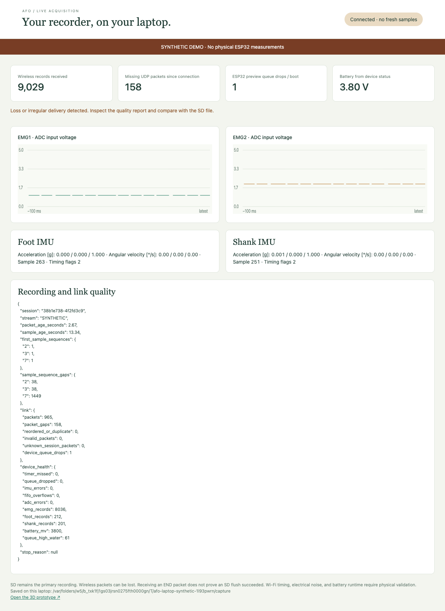

# Integrated recorder verification

Project lead: Muttakin Rahman · 1 October 2026 · AD7606 / two EMG inputs / ICM-42688-P

**Combined virtual execution found and corrected two recording defects: an ADC interrupt deadline failure and backwards IMU time estimates. An independent review then found a third issue: missing BUSY assertion could allow stale ADC words.** The nominal capture now contains 10,041 correctly identified EMG frames and both IMU streams, with valid file CRCs, no detected sample loss, no timestamp regressions and a normal saved END. The successful cloud capture is the preserved v1.5 baseline. The BUSY assertion correction is current v1.6 and has local driver/pipeline evidence, but has not executed in the whole-system cloud harness because quota is exhausted. No physical recorder has been measured. The full cloud matrix is still incomplete.

This report covers this configuration only. The other five designs retain their previous files and validation status. Electrical connections, PCB geometry and manufacturing files have not changed in this refinement.

## Tested versions

The cloud case ledger and captures below belong to **ad7606-2ch-1.5**. All 31 tested production-source, harness, configuration, model and image files are retained with their original paths in the [v1.5 snapshot manifest](../simulations/integrated-recorder/tested-source-1.5/manifest.json). Current laboratory firmware is **ad7606-2ch-1.6**, and all seven profiles have been recompiled. The current integrated candidate adds `adc-busy-stays-low` and `adc-trigger-ignored`, making **18 cases**. All 18 remain unexecuted on the current image; one actual `adc-busy-stays-low` attempt was refused by monthly CI quota. The preserved v1.5 matrix has 16 cases and retains its original outcomes. A compiled image or a passing native driver test does not turn the preserved v1.5 captures into v1.6 execution evidence.

## What executed together

The Wokwi image includes the production `main.c`, AD7606 and ICM drivers, serializer and Wi-Fi task. Actual ESP-IDF v5.4.2 FreeRTOS tasks acquire data, queue records, write and synchronize a real FatFS filesystem, initialize the ESP32 access point, and send actual AFW1 datagrams through lwIP. The real laptop decoder and converter process the exported bytes.

Four substitutions define the scope:

| Interface | Executed implementation | Substituted part |
|---|---|---|
| ADC and IMUs | ESP32 SPI peripheral, production drivers, conversion timer and interrupt handling | Project behavioral AD7606/ICM chip models; ideal digital signals |
| Storage | Production writes/sync/close, real FatFS and VFS, fault handling | Sparse PSRAM block medium replaces the card and SDMMC transport |
| Wireless | Actual access-point initialization, Wi-Fi task, lwIP UDP and laptop decoding | A UDP subscriber inside the emulated MCU replaces the laptop’s radio link |
| Battery and controls | Production start/stop, USB inhibition and low-battery logic | Defined voltage readings and button/USB fixture inputs |

Wokwi’s supplied microSD model uses SPI; it cannot validate this recorder’s unchanged SDMMC wiring. [Wokwi microSD documentation](https://docs.wokwi.com/parts/wokwi-microsd-card). Access-point startup and UDP loopback do not establish over-the-air reception. [Wokwi networking documentation](https://docs.wokwi.com/guides/esp32-wifi).

The simulation-only binary has additional trace instrumentation and fixture wrappers. **Never flash it onto the recorder.** Laboratory images are under `firmware/builds/`; simulation images are under `simulations/`. [Executed v1.5 source, configuration and image hashes](../simulations/integrated-recorder/tested-source-1.5/manifest.json).

## Corrections

### Conversion timing

The original recorder waited for the falling BUSY interrupt. In the combined simulation that notification arrived after the next 125 µs deadline, after about 2,385 valid frames. The driver correctly refused to overwrite an unread conversion, but continuous recording stopped. The failed capture remains in the package.

The acquisition timer and GPIO service now belong to core 1. After each CONVST pulse, the timer notifies the EMG task directly. The task checks BUSY before starting SCLK and fails after an 80 µs readiness wait. The next-period unread-result guard remains active. SPI still reads all eight 16-bit words through DOUTA in mode 2; only EMG1 and EMG2 are exported. A conversion deadline failure reports timing reason 6.

This removes the second interrupt handoff. It does not prove physical scheduling margins. Higher-priority interrupt experiments caused kernel failures and were reverted; those failed attempts are retained. The final combined run uses the ordinary interrupt priority and an enabled task watchdog.

### Missing BUSY assertion — current v1.6

A disconnected/stuck-low BUSY pin or ignored CONVST pulse could previously leave BUSY low and permit a serial read of stale conversion words. The current driver requires BUSY to be high at the end of the existing 1 µs CONVST pulse. This is consistent with the [AD7606 Rev G timing limits](https://www.analog.com/media/en/technical-documentation/data-sheets/AD7606_7606-6_7606-4.pdf): BUSY asserts within 45 ns, while the shortest listed conversion is 3.45 µs with oversampling disabled. A missing assertion latches a timing fault before accepting a frame. The later bounded BUSY-low wait still rejects stuck-high or delayed completion.

Sixteen native ADC groups and the local C pipeline exercise this correction, including independently injected stuck-low BUSY and ignored CONVST. This is mocked API evidence. The v1.6 whole-system Wokwi rerun is pending; earlier captures establish v1.5 behavior only. Physical timing and voltage checks remain required.

### IMU time reconstruction

Re-anchoring every FIFO burst to the latest interrupt created 35 backwards host-time estimates in one otherwise complete capture. An IRQ and a FIFO-count read can observe different sample boundaries.

The recorder now anchors the first estimate and advances subsequent estimates using the stored 16-bit sensor timestamp increments. Each IMU keeps its own state. Zero or implausible increments, backwards read times, and an unread interval spanning an entire 65,536 µs rollover are rejected explicitly. Missing counter intervals remain flagged. An IRQ arriving during a read indicates timing uncertainty; it does not by itself establish missing samples.

The raw FIFO packet, IRQ anchor and read window remain in every record. `imu_time=fifo_delta_first_irq` identifies the revised method. Estimates remain uncalibrated: sensor-clock drift, the initial anchor error and filter delays are not corrected. Legacy files retain their original interpretation.

The wireless sender also collects short batches rather than sending almost every EMG record in a separate datagram. Its collection target is 2 ms; RTOS scheduling and transport can add latency. Wi-Fi remains best-effort and cannot block or replace the saved recording.

## Preserved v1.5 integrated capture results

Sixteen cases were requested. **Ten completed with successful CLI execution and all applicable saved-file/laptop checks.** A separate nominal run completed and passed every firmware/file/UDP check, but its optional VCD retrieval ended with an API transport error. The low-battery run reached the correct saved stop; its UDP export was incomplete. Four cases did not execute because Wokwi exhausted the account’s monthly CI quota. They are not counted as passes.

| Case | Observed result | Status |
|---|---|---|
| Nominal recorder | 10,041 EMG; 263 foot; 252 shank; reason 0; exact known ADC codes; both identities; saved/live END agree | Firmware/file/UDP checks pass; optional VCD download failed |
| 50 ms write delay | 10,041 EMG; no saved-queue drops or ADC errors; complete SD recording; 344 best-effort Wi-Fi queue drops visible | Pass |
| 350 ms write stall | Queue overflow, explicit reason 2 and loss/counter evidence | Pass |
| Storage write error | Reason 1; unfinalized saved stream; wireless storage verdict | Pass |
| USB attached during recording | Explicit reason 7 and finalized abnormal stop | Pass |
| Low battery | 24,005 EMG; reason 4 after consecutive low readings; saved file exported; UDP export incomplete | Partial; whole case unverified |
| Stuck BUSY | Bounded failure; reason 6; no plausible replacement measurements | Pass |
| IMU FIFO overflow | Explicit reason 3 and overflow counter | Pass |
| Missing IMU interrupt | Explicit reason 3; no later clean session | Pass |
| No wireless subscriber | Complete saved recording; no subscriber datagrams | Pass |
| Wireless packet loss | 159 datagrams discarded; 158 observable sequence gaps; saved recording complete; lost live END remains unconfirmed | Pass |
| Interrupted recording | Reopened FatFS directory state lacks END; converter and receiver do not infer finalization | Pass |
| Mount failure | No new cloud execution | Pending quota |
| Full-card refusal | No new cloud execution | Pending quota |
| Filtered synthetic EMG | No new cloud execution; separate local C pipeline passes below | Pending cloud run |
| Absent shank IMU | No new cloud execution; historical diagnostic coverage retained | Pending quota |

The nominal EMG rate derived from ESP32 timestamps is approximately 7,983.87 Hz, within the declared virtual gate of 8 kHz ±1%. Foot/shank counts differ because the sensors start at different times and run independently. All 515 IMU records retain the timing-uncertain flag; none is presented as a calibrated timestamp.

[Complete result ledger](../simulations/integrated-recorder/results/current/summary.json) · [nominal recording](../simulations/integrated-recorder/results/current/normal/simulated-recording.afolog) · [nominal quality report](../simulations/integrated-recorder/results/current/normal/converted/quality.json) · [wireless loss report](../simulations/integrated-recorder/results/current/wireless-packet-loss/result.json).

Losing a wireless END is allowed by a best-effort link. The receiver correctly leaves `ended=false` and `stop_reason=null`; it must not invent a normal stop. The original test incorrectly required END despite deliberately dropping datagrams. Its initial failure and corrected assessment are both retained.

The low-battery fixture emitted idle-watchdog warnings while exporting a large serial dump after recording had stopped, and the 30-second capture limit expired before the UDP export terminator. The saved low-battery file is readable; this does not complete the wireless or whole-case gate. The current simulation fixture now yields an RTOS tick between post-recording export chunks, and the runner allows a 120-second simulated export window. These are capture-harness changes, not recorder firmware fixes or completed evidence. The v1.6 retry has not executed because of quota; the original v1.5 battery case remains partial.

All captures are synthetic. `.raw` files preserve the unmodified production output, including its original `synthetic=false` metadata field. The companion `.afolog` fixtures explicitly set `synthetic=true`. Neither contains a human recording.

## Local verification beyond the cloud runs

| Check | Result | What it establishes |
|---|---|---|
| Fresh KiCad ERC/DRC | Zero violations and unconnected items | Rules and connectivity, not physical performance |
| Independent net/pad/pin comparison | 390 component pins; 22 firmware GPIOs per profile; no mismatches | Schematic, actual PCB pads and PCB/breadboard GPIO definitions agree |
| Current v1.6 firmware compilation | All seven laboratory profiles compile | Three recording and four diagnostic ESP-IDF builds; hardware images remain unflashed |
| Current v1.6 ADC C driver | 16 groups pass; address/undefined sanitizer rerun passes | BUSY assertion/timeout, ignored CONVST, timer notification, signed order, disabled outputs, unread/late results and restart logic with mocked APIs |
| IMU timestamp helper | Eight groups pass; address/undefined sanitizer rerun passes | Counter rollovers, independent identities, monotonic estimates and rejection of ambiguity |
| Recorder control | 38 cases pass across both profiles | Production start/stop/write/sync/close/fault control with explicit API shims |
| Converter/live/legacy regressions | 40 tests pass | Format, scaling, invalid data, gaps and backwards compatibility |
| Integrated-evidence runner | 16 tests pass | Rejects partial/stale evidence, panics and plausible wrong codes; does not turn quota refusal into a pass |
| Current behavioral ADC model | 12 native groups pass with AddressSanitizer/UndefinedBehaviorSanitizer | Independent API stubs exercise the actual model callbacks; no Wokwi runtime, WASM or production-firmware execution |
| Local analog-to-file pipeline | 60 seconds; 480,000 EMG; 12,009 foot; 12,001 shank; correct known codes; zero regressions or unexplained loss | Actual current C ADC/IMU drivers, timestamp helper and serializer with ideal peripheral APIs; real host conversion |
| ngspice | Both channels agree; 16 tolerance corners; 54 DC/loading cases; analytical error below 0.02 dB | Documented analog surrogate and ideal quantization, not measured noise or op-amp qualification |
| Long queue model | Four one-hour event-count runs pass; 350 ms stall and inadequate throughput correctly overflow | Capacity under assumed write rates/latencies; no firmware or endurance execution |

The local pipeline feeds ngspice-filtered, explicitly synthetic RAW-like signals through the actual C peripheral drivers and serializer. A separate mocked register/FIFO model supplies the IMUs. It also confirms that a wrong serial mode can return plausible `-1` ADC values: known-input qualification is essential because the original AD7606 has no sensor-frame CRC or identity register.

The extended native pipeline covers 60 seconds of ordered C execution at the configured rates. The foot/shank models use +70/−110 ppm clocks, with 916/915 timestamp-counter rollovers respectively. Foot starts earlier and has one generated packet still in FIFO at stop; shank has none pending. All generated-versus-saved counts are explicit. This exercises counter rollover and recording conversion under modeled clocks, **not a 60-second ESP32 scheduler, SDMMC or radio endurance test**. The shorter two-second fixture and its plotted waveform remain available below.

[60-second pipeline evidence](../simulations/offline-pipeline/results/continuous-60-seconds/summary.json) · [current behavioral model checks](../simulations/integrated-recorder/model-test-results.json).

[Local pipeline evidence](../simulations/offline-pipeline/results/summary.json) · [generated recording](../simulations/offline-pipeline/results/synthetic.afolog) · [analog response](../simulations/results/frequency-response.png) · [queue budget](../simulations/offline-pipeline/results/queue-budget.json).

At 8,000 EMG frames and 400 IMU records per second, 64-byte records consume approximately 537,600 bytes/s before status/header overhead. The 2,048-record queue covers about 244 ms of arrivals. The one-hour model uses an assumed 2 MiB/s writer and specified stalls; it does not measure any card. A two-hour file is nominally about 3.87 GB, including per-second status records, under the [individual FAT32 file limit documented by Microsoft](https://learn.microsoft.com/en-us/windows/win32/fileio/filesystem-functionality-comparison). Actual card latency, free space and recording durability remain unqualified.

The previous seven diagnostic Wokwi scenarios and 300 FreeRTOS join/lifecycle cycles remain historical evidence. Their tested images and sources are preserved separately. The seven newly compiled laboratory profiles have not all been rerun in Wokwi; the exhausted quota prevents that claim. [Historical diagnostic source/image snapshot](../simulations/wokwi/tested-diagnostic-20260930/manifest.json).

## Captured timing audit

Nine post-processing test cases pass for the timing auditor, including known nominal evidence, counter rollover, causality, missing-gap flags and rejection of re-anchored or future estimates. This inspects **existing v1.5 captures**; it is not new firmware execution.

In the nominal file, CONVST timestamp intervals span 122–129 µs; trigger-to-read-start is 6–12 µs; recorded read duration is 23–29 µs; read completion precedes the next trigger by 89–98 µs. Both modeled IMU counters advance by 5,000 µs per packet, corresponding to 200 Hz. These observations describe the captured behavioral-model run, not physical interrupt jitter or clock accuracy.

The first shank estimate is **55,001 µs after the first foot estimate**, and foot has 11 additional startup packets. The firmware starts the sensors sequentially, with a 50 ms wait per `imu_start`; their counters have independent origins. This startup offset is explicit rather than called missing data. It does not calibrate foot/shank synchronization or EMG-to-IMU alignment. All reconstructed IMU estimates remain flagged uncertain.

The retained stuck-BUSY trace contains two initialization reads before the first CONVST, then one trigger and no post-trigger ADC read. RESET is not an analyzer channel, so the initialization classification relies on the known driver path rather than observing RESET directly. [Timing audit and raw-file hashes](../simulations/integrated-recorder/results/current/timing-audit.json).

## Laptop receiver, API and live display

The actual production receiver runs in a separate laptop process. Tests send the preserved **v1.5 AFW datagrams** through a real loopback UDP socket, query its HTTP API, exercise the live page in a browser, close the receiver cleanly and convert the resulting archive. Only metadata is relabeled synthetic; measurement record bytes and source packet gaps are preserved.

| Laptop replay | Observed records | Packet gaps | Display / archive result |
|---|---|---|---|
| Nominal capture | 10,558 | 0 | EMG1/2 only; approximately 1 V and 2 V; distinct foot/shank identities; END reason 0; finalized conversion |
| Packet-loss capture | 9,029 | 158 | Explicit gaps; only enabled channels; absent END leaves `ended=false` and reason null; converted archive retains sample gaps and missing-END finding |

Both cases pass receiver, HTTP, browser and archive checks. Corrupted CRC and duplicate datagrams are rejected without adding measurements. The browser reports an unavailable link when reception stops. This verifies laptop software and local sockets; no physical radio or ESP32-to-laptop link was exercised. [Laptop test report and reproduction](../simulations/laptop-tests/README.md) · [source hashes and results](../simulations/laptop-tests/results/summary.json).

## What is still required

The logical signal path and exercised v1.5 recording paths now have substantially stronger evidence. Current v1.6’s additional BUSY assertion safeguard has local mocked driver/pipeline evidence; its whole-system cloud rerun remains pending. **The full matrix and physical acceptance gates have not passed.** Remaining cloud cases are listed individually, and the package retains failed attempts, capture failures and source/image hashes.

Simulation cannot determine the received RoboticsBD board’s actual serial straps, VIO, reference or output voltage, nor real analog noise, protection behavior, power startup, temperature, crosstalk, cable integrity, radio performance, SDMMC reliability or battery runtime. The first physical gate remains ADC-module voltage/mode/reference qualification before ESP32 signal connections. Lab and human-testing prerequisites are unchanged; no board order is recommended or placed.

Follow the [variant-specific lab sequence](lab-quickstart.html) when instruments become available. In the meantime, the [integrated harness](../simulations/integrated-recorder/README.md) and [offline pipeline](../simulations/offline-pipeline/README.md) can reproduce the checks within their declared limits.
