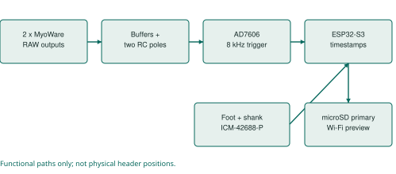
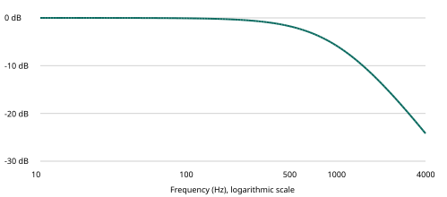
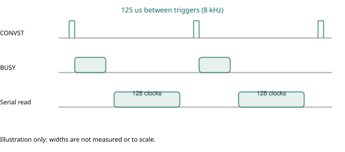
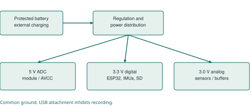

# Understanding my muscle and motion recorder

Muttakin Rahman | Supervisor meeting and laboratory preparation

Expanded edition: 7 October 2026. Active configuration: AD7606, two MyoWare 2.0 RAW channels, two ICM-42688-P carriers, ESP32-S3, microSD and Wi-Fi. Engineering prototype; physical measurements remain pending.

## 1. The project in one minute

I am developing a portable instrument to record muscle activity and lower-leg movement together. The immediate application is research involving ankle-foot orthoses (AFOs), with a broader interest in neuromuscular function. Two surface EMG channels observe selected muscles; two inertial sensors observe the foot and shank. The recorder preserves original digital measurements on microSD and offers a laptop preview over Wi-Fi.

The contribution at this stage is an acquisition platform, its implementation and a documented validation process. A separate research contribution must come from a well-defined question, sound experimental design and actual data. Using familiar components is not, by itself, evidence of novelty.

**What exists:** circuit and PCB files, a module-based laboratory build, firmware profiles, interactive assembly views, data conversion, behavioral simulations, software tests and a sequential testing workbook. **What does not yet exist in the evidence:** measured performance of an assembled recorder, participant recordings, demonstrated clinical validity or measured battery runtime. [P1-P4]

### A sentence I can safely use

“I have designed and virtually tested an EMG and motion recorder, and prepared a staged physical validation workflow. I am now working toward measured electrical, timing and data-quality performance before a supervised research pilot.”

### How to read this guide

Read sections 1-3 and 20 before a short meeting. Read sections 4-12 to understand the engineering. Use sections 13-17 beside the laboratory workbook. Sections 18-19 explain research design and analysis. The final sections provide a glossary, file map and sources. This document explains the design; the exact contact tables and circuit schematic remain the construction references.

## 2. The research question comes before the hardware

An AFO can change the mechanical conditions under which someone walks. A useful study could ask how a defined AFO condition relates to muscle activation and foot/shank motion during a specified task. The recorder provides observations relevant to that question; it does not automatically identify the cause of an observed difference.

| Measurement level | What this build provides | Additional work before interpretation |
|---|---|---|
| Electrical | Two digitized MyoWare RAW outputs | Verify offset, scaling, noise, clipping and calibration |
| Inertial | Acceleration and angular velocity at foot and shank | Verify axis orientation, bias, mounting and timing |
| Derived research feature | Potential EMG amplitude, activation timing, coactivation or motion features | Define processing, normalization, event labels and uncertainty |
| Clinical or biomechanical conclusion | No automatic conclusion | Appropriate reference, study design and clinical expertise |

The initially intended muscles are tibialis anterior and medial gastrocnemius. This is a restricted view of lower-leg activity. It does not observe all muscles that contribute to walking, distinguish every source of surface EMG, or measure joint force. Electrode locations and mounting must be chosen for the study and checked for AFO pressure and cable traction.

Neurology-related research is a legitimate motivation, but “neurology” is too broad to be an outcome. A task-specific coordination or gait question is more defensible than claiming the device diagnoses a neurological condition. This system has no EEG channel, nerve-conduction stimulation/recording system, force transducer or direct torque sensor.

### Decisions to take to my supervisor

Which participant population and task are feasible? What is the primary outcome? What is the smallest meaningful difference? Which independent reference establishes gait events or angles? What repeatability, timing and signal quality are necessary? These decisions determine whether the platform is adequate for the proposed study, rather than the other way around.

## 3. The complete architecture

The muscle path begins with a sensor output voltage. The analog circuit conditions that voltage, the AD7606 converts it, and the ESP32 manages timing and data movement. The motion path is already digital at the ICM carriers; its FIFO data travels to the ESP32 over a separate SPI bus. Both paths enter the recording system, but they do not share a physical sampling clock.

| Block | Selected implementation | Why it is present |
|---|---|---|
| Controller | ESP32-S3-DevKitC-1 N8R8 for bench; WROOM module on PCB | Acquisition, control, timestamps, SD and Wi-Fi |
| Muscle sensors | Two bare MyoWare 2.0 sensors | Condition surface EMG into RAW output voltage |
| External analog stage | Two filtered, buffered input paths | Defined unplugged bias and additional filtering |
| ADC | RBD-3184 AD7606 module for bench | Simultaneous conversion of the muscle channels |
| Motion sensors | Two MIKROE-4237 ICM-42688-P carriers | Foot and shank inertial measurements |
| Original storage | microSD using SDMMC | Preserve measurements without a laptop connection |
| Preview | ESP32 Wi-Fi and laptop receiver | Observe acquisition and expose wireless gaps |

No Raspberry Pi is required. The fixed-two build must not be confused with the expandable AD7606, ADS131M04 or MPU-6050 alternatives. Those configurations remain separate. Their files, sensor timing and firmware assumptions are not interchangeable.

## 4. What MyoWare RAW means

Surface EMG records an electrical signal associated with muscle activity through electrodes at the skin. The measured waveform is influenced by the recording arrangement as well as the physiology. A sensor on a moving limb can also respond to contact changes and mechanical disturbance. A large signal is therefore not automatically a strong or useful contraction measurement.

MyoWare provides RAW, rectified and envelope outputs. This build uses **RAW**, which is already amplified and conditioned by the sensor. Recording RAW preserves more freedom for subsequent processing than recording only an envelope. It does not recover information removed by the sensor's own analog response. [S2]

### Three voltages that must not be confused

- **Electrode signal:** the input to the sensor; not directly digitized by this recorder.
- **MyoWare RAW output:** the conditioned sensor voltage entering the recorder connector.
- **ADC input:** the voltage after the recorder's external filter/buffer chain.

The CSV voltage conversion reconstructs the ADC-side voltage using the configured nominal scale. Calling that number “microvolts at the muscle” requires a justified transfer/gain calibration; changing the displayed unit is not sufficient.

### Placement is part of the measurement

Document anatomical landmarks, muscle, leg side, sensor serial, electrode spacing and orientation. SENIAM provides placement guidance; the actual bare-sensor geometry and any departure must be recorded. Secure the sensor and cable so their movement does not pull the electrodes. This is a protocol issue, not a cosmetic detail. [S4, S5]

For repeated sessions, a photograph or placement diagram, landmark measurements and a reproducible task are more useful than the statement “placed on the same muscle.” Keep participant-identifying photographs in approved private storage, not the public repository.

## 5. Why the external analog circuit exists

Each channel has two buffered low-pass sections, using 3.3 kohm and 47 nF components, followed by a 100 ohm series resistor and 1 nF shunt capacitor at the ADC end. A 1 Mohm resistor biases an unplugged RAW input toward the buffered midpoint. The breadboard uses MCP6002 DIP devices; the custom PCB uses MCP6004/MCP6001 devices. The intended transfer function is shared, while physical parasitics and noise can differ. [P1]

### Buffering, filtering and biasing

A resistor-capacitor section attenuates faster variations. A unity-gain buffer follows its input while helping isolate that section from the next load. This makes the intended two-pole response easier to control than simply cascading two loaded passive sections.

Biasing gives an unplugged input a defined nominal resting voltage. It is not an additive mixing stage. It also does not provide a verified sensor-presence detector: a stable midpoint can mean an unplugged port or another nonphysiological condition. Record sensor connection state explicitly.

### Protection has boundaries

The BAV199 clamp arrangement and series resistance are part of the circuit, but protection performance is not physically qualified. A protection diode's forward drop can allow a node beyond an amplifier's permitted range. The AD7606's bipolar input range does not make the preceding 3 V buffer safe for arbitrary bipolar signals.

Use initial synthetic inputs between 0.1 and 2.9 V, including startup transients. Check the actual generator voltage at the circuit. Generator amplitude settings may assume a 50-ohm termination; a high-impedance load can receive a different amplitude. Never connect a person during instrument-driven bench tests.

The detailed circuit PDF contains the authoritative KiCad schematic and a bench interface map. The schematic uses net labels to connect repeated names electrically; two lines crossing without a junction are not necessarily connected.

## 6. Filter response and its consequences

For one unloaded RC pole, fc = 1 / (2 pi R C). With R = 3300 ohms and C = 47 nF, fc is approximately 1026 Hz. For two identical ideally buffered poles, the magnitude is 1 / (1 + (f/fc)^2). These equations describe the external RC network, not the complete biological-to-digital chain.

| Frequency | Nominal external gain | Meaning |
|---|---|---|
| 20 Hz | Approximately 0 dB | Little attenuation from these two poles |
| 100 Hz | Approximately -0.08 dB | Small amplitude change |
| 500 Hz | Approximately -1.85 dB | About 81% of the input amplitude |
| 1000 Hz | Approximately -5.80 dB | Substantial attenuation |
| 4000 Hz | Approximately -24.19 dB | Finite rejection, not complete removal |

The combined -3 dB frequency is approximately 660 Hz, lower than either individual pole. The nominal group delay of these two poles is about 2RC / (1 + (2 pi f RC)^2): about 0.31 ms near DC and 0.25 ms at 500 Hz. These are calculated examples only; MyoWare, ADC internal response and software processing add further effects.

Component tolerances move the response. The preserved ngspice work covers tolerance and loading cases, but substitutes a buffer model. It does not establish real amplifier noise, offset, supply rejection or clipping headroom. Frequency features and onset comparisons need the actual chain's response, not only a neat simulation plot. [P1]

## 7. Digitization, resolution and calibration

The selected conversion setting is signed 16-bit, +/-5 V. The project decoder uses V = code x 5 / 32768. Reading all eight words does not create eight research channels: this build keeps two muscle inputs. [P1, S1]

| Applied voltage, ideal example | Expected approximate code |
|---|---|
| 0 V | 0 |
| 1 V | 6554 |
| 1.5 V | 9830 |
| 2 V | 13107 |
| 3 V | 19661 |

One nominal code represents 152.588 microvolts at the ADC input. A 0-3 V span uses about 19,661 code intervals, or log2(19661) = 14.26 ideal bits of span. This does not estimate effective number of bits: actual noise and distortion must be measured. A 16-bit data word is a format, not a guarantee of 16-bit physiological accuracy.

### Work through one sample

For code 10,000, the reconstructed input is 1.5258789 V. If an analysis later subtracts a measured baseline of 1.5000 V, its residual is 25.8789 mV. The original sample should remain unchanged. The residual is still a sensor-output quantity unless electrode-referred scaling has been justified.

The metadata value `input_midpoint_mv=0` means the converter does not subtract a reconstruction offset. The physical unplugged bias is described separately as nominally 1.5 V. Confusing these fields previously created a misleading analog-stage description, which has been corrected.

### Calibration procedure to propose

Use several independently measured DC levels within the safe analog domain. Record both applied voltage and output codes for each channel, fit offset/gain if justified, and test separate levels not used for fitting. Preserve the raw coefficients, residuals, source/meter uncertainty and calibration date. Repeat with the second channel driven and under relevant digital load. Do not silently replace nominal metadata with an unmeasured reference value.

## 8. Conversion timing and fault logic

The target interval is 125 us, corresponding to 8,000 EMG frames/s. Both CONVST inputs share a trigger. BUSY acknowledges conversion; the serial read follows completion. The configured read clocks 128 bits at 8 MHz, taking 16 us. Adding the listed 4.2 us maximum conversion time gives approximately 20.2 us before software overhead. That arithmetic supports feasibility, not a guarantee under real scheduling load. [P1]

The current driver checks that BUSY asserts and refuses to label stale words as a new frame. It also handles late reads and unread conversions. A missing assertion, ignored trigger or stuck line must become an explicit fault. The 80 us deadline is an error-handling limit; normal conversion is much shorter.

**AD7606 has no chip frame CRC or register identity readback in this original-device interface.** Known DC inputs and swapped-channel tests are therefore essential. A byte stream can be correctly packaged while originating from the wrong analog pin, range or mode.

Diagnostic acquisition deliberately stops between roughly one-second windows to print. Those gaps are intentional and cannot count as a continuous 60-minute acquisition test. Current recording firmware wakes the ADC reader directly from the trigger timing path; diagnostic windows use their own interrupt path. Use the correct profile for the question being tested.

For a timing claim, retain a raw logic capture containing CONVST, BUSY, CS, SCLK and DOUTA, with the instrument sample rate and timebase settings. Report distributions and worst cases, not only the average frequency.

## 9. Motion sensing and independent clocks

Each ICM-42688-P carrier supplies three accelerometer and three gyroscope axes. The selected configuration targets 200 Hz with +/-16 g and +/-2000 degrees/s ranges. The two carriers share SPI but have separate chip-select and interrupt lines. Carrier jumper positions and physical connector orientation must match the selected MIKROE board documentation. [P1, S3]

### Understand the axes before using an angle

At rest, gravity contributes to accelerometer readings. A six-face test checks whether the expected axis changes sign and magnitude when the device is reoriented. A stationary gyro test characterizes bias. Rotating only the foot module should not appear as shank motion through a labeling or wiring error.

A mounting-axis diagram identifies how sensor coordinates relate to each segment. Sensor-to-segment calibration, orientation estimation and a validated convention are required before interpreting relative orientation as an ankle measure. Taking the difference between two arbitrary Euler-angle columns is not a general joint-angle solution.

### Timestamps are evidence, not decoration

A FIFO is an ordered buffer of sensor packets. Delayed reading can still preserve samples, but a FIFO overflow loses information. The project retains sensor counter values, interrupt anchors, read windows and quality flags. Its reconstructed host times are estimates, not a shared hardware clock.

At the configured 1 us tick, a 16-bit counter wraps after 65.536 ms. A wrap is normal; a sufficiently long unexplained gap can make the number of wraps ambiguous. Do not invent elapsed cycles after corrupted or missing data. Two sensors starting at different moments can have different sample counts without a fault. Align by justified timing, never by matching row numbers. [P1, P3]

## 10. Synchronization and uncertainty

There are at least four relevant times: when the physical event occurred, when the sensor responded, when a sample was taken, and when software received or saved it. These are not interchangeable. Storage time is particularly unsuitable as a substitute for acquisition time.

| Contribution | What must be characterized |
|---|---|
| Analog chain | Frequency-dependent delay and amplitude response |
| ADC/host timing | Trigger cadence, jitter, late reads and gaps |
| IMU clocks | Offset, drift, FIFO reconstruction and timing flags |
| Motion reference | Event definition, sampling rate and annotation uncertainty |
| Analysis | Filtering, smoothing, resampling and onset-detection effects |

**Illustrative example, not a project result:** a 100 ppm relative clock difference accumulates 6 ms in 60 seconds. A 200 Hz stream has 5 ms spacing. These scales can matter when the intended effect is a few milliseconds, even if EMG is sampled much faster.

To validate cross-modal timing, use a safe bench event or fixture whose electrical and mechanical manifestations can be independently observed and timed. Establish the fixture's own delays. Merely tapping an IMU does not simultaneously create a known EMG event. Do not inject electrical test signals through a person.

Once physical acquisition works, compare the start and end of a sustained run against the chosen reference. Estimate offset and drift, preserve residuals, and test the method on independent events. If the uncertainty is larger than the scientific effect of interest, improve the method or choose a less timing-sensitive outcome.

Offline zero-phase filtering can change onset interpretation through acausal spreading; causal filtering introduces delay. State which method was used and why. More decimal places in a CSV timestamp do not establish more timing accuracy.

## 11. Power, grounding and USB

The design separates digital power, analog power and the ADC's 5 V supply while retaining a common electrical reference. Separate regulators do not create galvanic isolation. Return-current paths, connector resistance and decoupling placement still affect the analog signal. [P1, P2]

| Project screen | Target | How to use it |
|---|---|---|
| Digital rail and VIO | 3.23-3.43 V | Measure at the connected load |
| Analog rail | 2.94-3.06 V | Check under sensor/buffer load |
| ADC rail | 4.80-5.20 V | Include startup and load changes |
| Midpoint | 0.49-0.51 x measured analog rail | Use a ratio, not only nominal 1.5 V |

These are project screens, not replacements for device ratings. The ADC's broader AVCC operating interval is 4.75-5.25 V. A DC meter can miss short dips or overshoot; scope captures are necessary where specified. The workbook retains provisional ripple/noise criteria and records uncertainty.

The PCB uses a reverse-polarity MOSFET, TPS63070 digital conversion, TPS7A2030 analog regulation and TPS60150 ADC supply. The bench uses selected regulator modules and an analog-regulator adapter. Do not reproduce high-frequency switching loops using loose ICs on a solderless breadboard.

USB detection is active LOW at GPIO21. The recording interlock is a firmware precaution, not patient isolation. DevKit USB power paths must be understood before external regulation is connected. No person is attached during instrument/USB bench tests. Before any approved wearable recording, remove charging, USB and instrument connections. Protected battery circuitry and a low-battery threshold do not independently establish human-use safety.

## 12. Firmware, storage and wireless preview

The acquisition tasks produce records; a queue temporarily holds them; the writer stores blocks on microSD. Keeping acquisition separate from slow storage reduces interference, but finite buffers only absorb finite delays. Firmware 1.7 keeps a 20,480-record queue in PSRAM; at 8,400 nominal data records/s it holds about 2.44 seconds if initially empty (firmware 1.6 held only 0.244 s, less than the 250-500 ms write-busy time an SD card may legally take). Occupancy and other records reduce the available margin, so stage 7 records the peak queue occupancy.

Each EMG record represents two simultaneous channel values, not two separately timestamped records. At 64 bytes per record, 8,000 EMG plus 400 IMU records/s imply 537,600 bytes/s, about 1.935 GB/hour or 3.871 GB/two hours before overhead. Card capacity and sustained write behavior are different requirements. A fast-looking card label does not establish bounded write latency.

### Normal lifecycle

Select the correct firmware; initialize the required interfaces; check recording prerequisites; write session metadata; start acquisition; collect samples and status; stop producers; finish stored data and file operations; inspect stop/error status. Removing power too early can leave an incomplete recording even when a filename exists.

### Wi-Fi is a second path

The laptop preview is best effort. It can lose data independently of SD. Keep the original SD file as the principal recording and compare it with the laptop archive during testing. A preview gap must remain visible; interpolation must never masquerade as an acquired sample.

This project uses SDMMC. Wokwi's supplied SPI-card model is not a drop-in validation of the unchanged storage wiring. The integrated tests use documented substitutions. The current breadboard SD CMD is GPIO47; the PCB uses GPIO38. Choosing the wrong image can fail a correct physical assembly. [P2-P4]

## 13. Reading the recorded data correctly

Keep the original `.afolog` file unchanged and record its SHA-256. Convert copies into a new output folder. Preserve the metadata, quality report and separate EMG/foot/shank CSV streams together. Data cleaning and derived features belong in additional folders with the processing version recorded.

| Check first | Why it matters |
|---|---|
| Hardware, ADC, IMU and channel metadata | Prevent decoding or interpreting the wrong setup |
| Counters, CRC and record boundaries | Detect missing/corrupted stored information |
| Timestamps and quality flags | Expose uncertainty instead of assuming synchrony |
| Stop reason, END and filesystem status | Distinguish a clean stop from incomplete persistence |
| Signal range and baseline | Detect obvious scaling or clipping problems |
| Trial and placement labels | Link numerical values to the actual experiment |

CRC confirms consistency of encoded bytes; it does not prove the muscle or input voltage was correct. An upstream analog amplifier can saturate while the ADC remains far below its own full-scale code. Therefore an ADC clipping flag alone is not a sufficient analog saturation test.

### A preserved example

The synthetic example contains 10,041 EMG frames, 263 foot samples and 252 shank samples, plus status and END. The captured wireless stream lacks EMG sequence 5330 while the saved file retains it. This demonstrates separate loss reporting; it is not a new patient or hardware measurement. Its observed host-derived EMG rate is about 7,983.86 Hz, which does not establish the physical 8 kHz +/-0.1% gate. [P4]

Use the converter's documented `--no-plots` option if optional plotting dependencies are unavailable. A warning exit code is a reason to inspect quality, not an instruction to delete evidence. Recovery should retain verified records and explicitly identify damage; it must not silently fabricate a complete session.

## 14. Build stages 00-03: establish the foundation

The private working copy of each stage folder should contain one subfolder per attempt. Photograph the exact configuration, retain failed results and record one change at a time. Blank template sheets are not test evidence. The full workbook supplies numerical criteria and exact contacts. [P5]

| Stage | Add and test | Send for review |
|---|---|---|
| 00 | Confirm part identities, quantities, pinout sources and instruments | Inventory; front/back module photos; instrument list and calibration information |
| 01A-D | Digital supply, ADC supply, analog supply, then midpoint; unloaded and dummy-load tests | DMM readings, startup/load traces, supply current limit, actual loads, temperature and polarity checks |
| 02 | ESP32, button, LEDs and USB sensing | Firmware application hash, serial log, 20 reset/programming cycles, GPIO21 states, loaded rail readings |
| 03A | Qualify AD7606 before connecting ESP32 signal wires | Strap continuity, AVCC/VIO/reference measurements and output logic levels |
| 03B | Add digital interface and known DC sources | Logic trace, measured 1 V/2 V inputs, codes, swapped-channel evidence and cadence |

**Power first:** choose the supply current limit with reference to the selected module's documented startup needs. Record it. Unexpected limiting requires diagnosis, not repeated increases. For a 3.3 V / 300 mA dummy load, R is about 11 ohms and dissipation is about 0.99 W; a suitably mounted resistor rated at least 2 W is an initial example, not a thermal guarantee.

**ADC second:** a label saying VIO does not prove that it is isolated from 5 V. Inspect the delivered module, verify its serial selection and qualify voltages before the ESP32 pins are exposed. Clocking plausible values is weaker evidence than applying measured, unequal voltages and proving channel identity.

Disconnect battery, USB and lab supply, and disable generator outputs before rewiring. Recheck polarity and continuity at every addition.

## 15. Build stages 04-06: signals and motion

| Stage | Add and test | Evidence to retain |
|---|---|---|
| 04 | One complete analog channel with synthetic signals | Input/output amplitude and phase, DC level, unplugged settling, generator settings and actual terminal voltage |
| 05 | Second channel, then interactions | Both response tables, identity swaps, baseline noise spectrum/RMS and driven/quiet channel comparison |
| 06A | Foot carrier | Identity/readback, SPI jumper photo, six static orientations, gyro baseline, FIFO/interrupt counts |
| 06B | Shank carrier alongside foot | Separate identity/motion tests, both IRQ traces, timing records and cable tests |

Begin analog tests with a 1.5 V-biased 100 mV peak-to-peak sine, remaining within the safe test domain. Compare multiple frequencies with the tolerance envelope rather than checking only a single sine wave. Calculate gain using the measured amplitude ratio at the two nodes.

For electronic crosstalk, drive channel 1 and hold channel 2 at a defined level, then reverse. The provisional screen is below -40 dB relative to the driven signal. A quiet channel below the instrument noise floor gives an upper bound, not an exact crosstalk measurement. This test says nothing by itself about physiological crosstalk from neighboring muscles.

The current IMU diagnostic also runs the ADC. Keep the accepted ADC configuration attached. Controller-only diagnostics do not need ADC, SD, IMUs or Wi-Fi; later profiles have different dependencies. This distinction prevents a missing earlier module from being misdiagnosed as a failed new sensor.

After each addition, remeasure the rails and rerun affected earlier checks. If the second IMU disturbs the first, investigate shared power, grounds, chip-select behavior and cable routing before modifying the signal-processing algorithm.

## 16. Build stages 07-10: integration and research readiness

| Stage | Gate | Evidence to retain |
|---|---|---|
| 07 | Short conversion check, then 60-minute SD run and storage faults | Original files, metadata/quality, card details, stop status, interrupted originals and recovery outputs |
| 08 | SD plus Wi-Fi, including receiver disconnects | Both original archives, disconnect times, counters and loaded rail/noise traces |
| 09 | Protected battery, repeatable starts/stops and measured runtime | Voltage/current/temperature log, pack information, events, original recordings |
| 10A | MyoWare electrical integration without a person | Pad identity, supply/routing checks and no-person sensor integration evidence |
| 10B-C | Authorized supervised mounting and pilot | Approval reference, pseudonymous labels, placement/calibration records and reference events |

A 60-minute run must have no unexplained saved-sample loss, queue faults or integrity errors under the specified test conditions. Repeat with Wi-Fi load. Full-card and controlled interrupted-power tests use expendable media and preserve the damaged originals. END alone cannot certify that a final sync/close operation succeeded.

Two-hour battery runtime is a requirement to measure. The firmware also has a two-hour session limit; distinguish an intentional session stop from pack exhaustion. Do not defeat pack protection or deliberately overdischarge to demonstrate a runtime number.

The safety/ethics gate is independent of engineering completion. Skin electrodes must not be attached while charging or connected to USB/lab instruments. The protocol must address participants, mounting, adverse events, data protection and supervision. This guide is not an institutional approval or a medical-device certification.

The evidence checker reports missing fields and files, hashes and required check IDs. Even “READY FOR HUMAN REVIEW” means only that the submission is ready to inspect. The reviewer still evaluates the actual traces, units, limits and uncertainty. [P5]

## 17. Troubleshooting and what simulation establishes

| Symptom | First distinctions to investigate |
|---|---|
| Nearly constant 1.5 V | Unplugged bias, input path continuity, applied stimulus or saturation elsewhere |
| Two channels look swapped | Physical V1/V2 mapping, sensor labels and metadata; use unequal DC sources |
| Plausible but unchanging ADC values | CONVST/BUSY acknowledgement, serial mode and stale-data fault logic |
| IMU identity passes but movement is wrong | Axis mounting, data interpretation, foot/shank labels and FIFO configuration |
| SD error with a working preview | Correct SD profile/pins, card supply, filesystem and writer fault report |
| Noise increases with Wi-Fi | Supply/ground coupling, wiring, local decoupling and measurement setup |

Return to the last accepted stage. Do not change firmware, wiring and filters simultaneously; doing so destroys the ability to identify which change caused the outcome.

### Evidence ladder

The preserved circuit checks compare 390 schematic/PCB pin connections and 22 firmware GPIO assignments per profile. Host tests exercise decoding and faults. Native driver tests execute production code with mocked peripherals. Wokwi executes firmware with behavioral/substituted devices. Analog simulations explore an assumed circuit model. Each level answers a different question. [P1, P3, P4]

The reports retain 18 passing current integrated Wokwi cases, but not every case was run on an identical complete visual fixture. Historical images and incomplete attempts remain separate. QEMU nominal timing was unqualified. The current laboratory diagnostic images were compiled but not all rerun in Wokwi. Do not collapse these into “the whole hardware passed.”

The latest preserved package receipt reports 46 host tests and nine evidence-checker tests. This expanded guide reviews those records; it is not a fresh execution of every historical test. No assembled-hardware results have been added.

## 18. Designing an AFO or neuromuscular study

A concrete initial discussion could be: “Within the same participants and at controlled walking conditions, how does a defined AFO configuration relate to normalized TA activity during independently labeled swing?” This is a candidate question, not an approved protocol or guaranteed publishable claim.

| Design decision | Record before study collection |
|---|---|
| Population | Eligibility, clinical collaborators and feasible recruitment |
| Primary outcome | Feature, units, phase/window and meaningful effect |
| Conditions | AFO setting, footwear, speed, task, order and rest |
| Reference | Gait-event or angle reference, its calibration and uncertainty |
| Repetition | Trials, sessions, remounting and operator consistency |
| Exclusions | Predetermined artifact, dropout, clipping and label rules |
| Analysis | Repeated-measures structure, uncertainty and missing-data handling |

A pilot should establish feasibility and variance, including remounting and repeated sessions where relevant. Sample-size planning depends on the participant-level outcome and design. Millions of time samples from one person are not millions of independent participants.

EMG normalization needs to match the intended comparison. A maximum task, standardized submaximal reference or another justified approach has different implications. Do not prescribe maximal contractions without considering the participant population and approved protocol. CEDE provides a decision framework; there is no universal normalization that makes every comparison valid. [S6]

A lower amplitude could reflect task strategy, contact/placement changes, speed or normalization differences. Interpret it alongside the protocol and reference measurements. Surface EMG does not directly supply muscle force; force estimation is a separate modeling and validation problem. [S7]

If using machine learning, keep participant/session/trial boundaries intact. For generalization to new people, evaluate on held-out participants. Overlapping windows from one trial must not leak across training and test partitions.

## 19. From raw records to a defensible analysis

A reproducible pipeline should make every transformation explicit: immutable original file; integrity review; calibrated units if justified; time alignment with uncertainty; documented filtering; artifact marking; segmentation using reference events; feature calculation; participant-level analysis; sensitivity checks.

### Worked feature example

For a baseline-adjusted signal x with N samples, RMS = sqrt(sum(x[i]^2)/N). At 8 kHz, a 50 ms window contains 400 samples. A shorter window can follow rapid changes but has different variability and frequency behavior. This 50 ms example is explanatory, not the selected study setting.

An amplitude normalization could divide a task RMS by a defined reference RMS. Record how the reference was collected and processed. Avoid presenting a percentage without naming its denominator. Normalizing by the maximum of each test condition can also change what a between-condition comparison means.

Activation onset requires a definition: baseline period, threshold rule, minimum duration, preprocessing and treatment of artifacts. A threshold crossing may be noise or movement artifact. Validate onset detection against appropriate evidence and report sensitivity to reasonable parameter choices.

Coactivation likewise requires an explicit formula, time interval and normalization. Multiple formulations answer different questions. Frequency features require care because sensor and recorder filters shape the spectrum. Do not interpret every change in median frequency as fatigue without a suitable task and analysis design.

### Preserve an audit trail

Use a pseudonymous session ID linked to firmware hash, sensor identities, muscle mapping, leg side, AFO condition, mounting, calibration and event-label source. Keep analysis code/version and exclusions alongside derived outputs. Missing values should remain identifiable; any interpolation belongs in a named derived dataset with its method documented. [P4, P5]

## 20. Meeting script and difficult questions

### A two-minute explanation

“I am building a portable research recorder that combines two surface EMG channels with foot and shank motion sensing. My immediate interest is how AFO conditions relate to muscle activity and movement. MyoWare supplies conditioned RAW EMG, the AD7606 samples the two inputs simultaneously, and an ESP32 stores the original records on microSD while offering a Wi-Fi preview. The motion sensors retain independent timing information rather than assuming perfect synchronization.

“I have circuit files, firmware, conversion tools and simulation evidence. I have separated those results from unperformed physical tests. The build sequence starts with power and known electrical inputs, then adds analog channels, IMUs, storage, wireless and battery. Only after these gates and the necessary approvals would I conduct a pilot. I would like to agree on the first research question, reference measurement and accuracy requirements before collecting participant data.”

| Supervisor question | A defensible answer |
|---|---|
| Why 8 kHz if the EMG bandwidth is lower? | It is the current acquisition target and supports detailed timing/processing; it does not restore filtered frequencies and costs storage/power. Its necessity can be evaluated after validation. |
| Why an eight-channel ADC for two muscles? | It is an obtainable simultaneous-conversion option. This fixed-two design implements two analog paths; extra chip channels are not usable muscle channels without redesign. |
| Is 16-bit resolution sufficient? | The word width alone cannot decide that. Measure noise, usable span and the smallest effect required by the study. |
| Are EMG and motion synchronized? | Timing evidence is retained, but cross-modal alignment accuracy remains to be measured. |
| Does simulation prove it works? | It tests specified models and code paths. Physical electrical and sustained timing behavior remain pending. |
| What is the novelty? | The instrument enables a study; a defensible novel claim still needs a specific question and prior-art evaluation. |
| What support is needed next? | Lab instruments, exact parts, staged testing, reference measurement access and research/clinical supervision. |

## 21. Circuit drawings and the final PCB

The accompanying [circuit-diagrams.pdf](circuit-diagrams.pdf) begins with a bench interface reading map and then includes the actual KiCad schematic export for this fixed-two AD7606/ICM recorder. The reading map explains connections; it is not a solderless-breadboard hole layout. The exact physical tables and 3D view remain separate aids. Chip pin numbers, ESP32 GPIO numbers and connector contact numbers are different identifiers.

| Block | Bench implementation | PCB distinction |
|---|---|---|
| Controller | DevKitC-1 with onboard support circuits | WROOM module with custom power/reset/USB layout |
| Digital supply | Selected regulator module | TPS63070 switching converter layout |
| ADC supply | Selected 5 V module | TPS60150 charge pump |
| Analog buffers | MCP6002 DIP fixtures | MCP6004/MCP6001 SMD circuits |
| ADC | Qualified RBD-3184 module | Bare AD7606 with local reference and bypassing |
| SD CMD | GPIO47 | GPIO38; matching firmware required |

The PCB remains an engineering prototype. Successful bench tests reduce uncertainty about signal logic and firmware, but do not establish PCB switching noise, thermal performance, antenna clearance effects or USB signal integrity. The final board needs its own staged bring-up.

In the schematic, repeated net names join electrically even where a long wire is not drawn. Read decoupling, unused-input termination, reset and reference circuits as part of the design, not optional decoration. Do not infer a module header from the AD7606 package pinout. The module qualification procedure is required before connecting its outputs to ESP32 pins.

The website's other five variants are preserved for separate work. A four-channel guide, an MPU-6050 address assignment or an ADS131M04 driver must not be borrowed into this build without an explicit redesign.

## 22. Glossary and practical file map

| Term | Meaning in this project |
|---|---|
| AFO | Ankle-foot orthosis |
| sEMG / RAW | Surface electromyography; here RAW denotes the sensor's conditioned output |
| ADC / LSB | Analog-to-digital converter; one nominal digital code step |
| Bias / baseline | Electrical operating level / measured reference level; related but not interchangeable |
| FIFO | Ordered sensor buffer, which can overflow |
| SPI / SDMMC | Digital sensor bus / the selected storage interface |
| CONVST / BUSY | ADC trigger / conversion acknowledgement and activity signal |
| CRC / SHA-256 | Record-integrity check / file-identity hash; neither proves physiological validity |
| Jitter / drift | Short-term timing variation / accumulated relative clock error |
| Calibration | Measured relationship between known input and indicated output |
| Validation | Evidence that a method is adequate for its stated use |
| Artifact / crosstalk | Unwanted measurement contribution / coupling from another channel or muscle |

Start at the development workbook. Each numbered folder contains a stage card, new wires, probe contacts, fixture components, results sheet and submission metadata. Copy it privately for real attempts; do not overwrite blank public templates with participant information.

Useful project paths relative to this variant: `development/index.html`, `development/logic-review.md`, `development/research-planning.md`, `development/research-session-template.json`, `docs/build-guide.html`, `docs/module-qualification.md`, `docs/laptop-setup.html`, `docs/kit-validation.json`, and `hardware/main/afo_revb_main.kicad_sch`.

The next practical evidence is stage 00: acquired/proposed parts, clear module photographs and available instruments. The next scientific decision is a primary outcome and its required accuracy. Progress on both tracks makes the next build decision more useful.

## 23. Sources and evidence provenance

Source labels distinguish manufacturer/research guidance (S) from this project's implementation and test records (P). External pages were checked on 7 October 2026 where accessible. SENIAM URLs were unavailable during this refresh; they are retained as established placement references, not presented as freshly retrieved pages. No new physical measurements were performed for this edition.

- **S1. Analog Devices.** Original AD7606 family, Rev G datasheet. Device operation and limits; not proof of a seller module's implementation. https://www.analog.com/media/en/technical-documentation/data-sheets/AD7606_7606-6_7606-4.pdf
- **S2. Advancer Technologies / SparkFun.** MyoWare 2.0 Advanced Guide. Output types and sensor operation. https://cdn.sparkfun.com/assets/learn_tutorials/1/9/5/6/MyoWare_v2_AdvancedGuide-Updated.pdf
- **S3. MikroElektronika.** 6DOF IMU 14 Click / MIKROE-4237 documentation. Selected carrier interface. https://www.mikroe.com/6dof-imu-14-click
- **S4. SENIAM.** Lower-leg sensor locations. https://seniam.org/lowerleg_location.htm
- **S5. SENIAM.** Sensor placement and fixation. https://www.seniam.org/fixation.htm
- **S6. Besomi et al., 2020.** CEDE: Amplitude normalization matrix. Journal of Electromyography and Kinesiology 53, 102438. https://pubmed.ncbi.nlm.nih.gov/32569878/
- **S7. CEDE, 2024.** Application of EMG to estimate muscle force. Consult the full guidance before designing a force-estimation method. https://pubmed.ncbi.nlm.nih.gov/39069427/
- **P1. Project circuit audit and source specification.** Values, pins, correction history and simulation limitations. https://shadowfax-505.github.io/afo-recorder/designs/ad7606-two-channel-icm42688/docs/circuit-audit.html
- **P2. Bench/PCB differences.** Physical implementation exceptions. https://shadowfax-505.github.io/afo-recorder/designs/ad7606-two-channel-icm42688/docs/bench-pcb-differences.md
- **P3. Integrated verification.** Execution scope, substitutions and preserved failures. https://shadowfax-505.github.io/afo-recorder/designs/ad7606-two-channel-icm42688/docs/integrated-verification.html
- **P4. Package/data verification receipt.** Preserved synthetic counts, timing flags, nine intake tests and 46 host tests. https://shadowfax-505.github.io/afo-recorder/designs/ad7606-two-channel-icm42688/docs/kit-validation.json
- **P5. Sequential development workbook.** Exact stage evidence and unperformed physical gates. https://shadowfax-505.github.io/afo-recorder/designs/ad7606-two-channel-icm42688/development/index.html

All diagrams in this guide are original explanatory drawings of the project. The separate detailed schematic is exported from the existing project KiCad source. Existing third-party notices remain applicable. This guide does not establish medical-device certification, intellectual-property clearance or research novelty.
