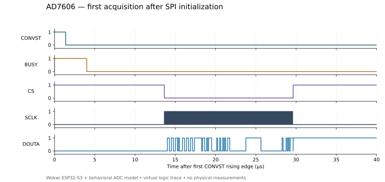

# Historical ESP32-S3 diagnostic verification

Project lead: Muttakin Rahman · 30 September 2026 · AD7606 / two EMG inputs / ICM-42688-P

**Seven scenarios passed using the earlier actual ESP-IDF v5.4.2 stage-6 diagnostic binary in Wokwi CLI 0.27.1.** Its [tested source/image snapshot](../simulations/wokwi/tested-diagnostic-20260930/manifest.json) is preserved. The current diagnostic binaries were recompiled after acquisition changes; this historical seven-case matrix has not been rerun on them. Current recorder/FatFS/UDP execution separately passes 18 cases through the web editor; see the [integrated report](integrated-verification.html). This report establishes only its historical image’s modeled digital behavior. Physical hardware has not been measured. [Machine-readable results](../simulations/wokwi/results/scenarios.json).

## Corrections found by execution

The first ADC read had a one-bit shift during initial mode-2 clock setup. The driver now makes a discarded SPI read while AD7606 RESET is asserted, before any conversion trigger or sample counter. Both measured windows then contain exact channel codes 6554 / 13107. This initialization remains included in all seven current recompiled profiles. The received ADC chip/module still needs a scope check at first startup.

A FIFO-overflow error in the diagnostic worker previously allowed the main task to restart acquisition and print a later window. A shared atomic fault latch now stops both tasks and preserves the first error. FIFO overflow produces one explicit failure with no later completed window.

The browser warning was insufficient evidence of a permanent stall: the authenticated CLI runs complete. The large analyzer-buffer experiment disconnected while exporting the trace; the released setup uses the working one-million-event buffer.

## Expected and observed

| Scenario | Expected observation | Serial check | VCD check |
|---|---|---|---|
| normal | WINDOW_COMPLETE | PASS | [PASS trace analysis](../simulations/wokwi/results/normal.trace.json) · [VCD.gz](../simulations/wokwi/results/normal.vcd.gz) |
| stuck-busy | FAIL,ADC BUSY edge timeout | PASS | [PASS trace analysis](../simulations/wokwi/results/stuck-busy.trace.json) · [VCD.gz](../simulations/wokwi/results/stuck-busy.vcd.gz) |
| delayed-busy | FAIL,ADC late conversion/read | PASS | [PASS trace analysis](../simulations/wokwi/results/delayed-busy.trace.json) · [VCD.gz](../simulations/wokwi/results/delayed-busy.vcd.gz) |
| incorrect-mode | codes differ from known stimulus | PASS | [PASS trace analysis](../simulations/wokwi/results/incorrect-mode.trace.json) · [VCD.gz](../simulations/wokwi/results/incorrect-mode.vcd.gz) |
| absent-shank | FAIL,IMU init/identity/readback | PASS | [PASS trace analysis](../simulations/wokwi/results/absent-shank.trace.json) · [VCD.gz](../simulations/wokwi/results/absent-shank.vcd.gz) |
| fifo-overflow | FAIL,IMU FIFO/read | PASS | [PASS trace analysis](../simulations/wokwi/results/fifo-overflow.trace.json) · [VCD.gz](../simulations/wokwi/results/fifo-overflow.vcd.gz) |
| missed-interrupt | FAIL,IMU missing interrupts/data | PASS | [PASS trace analysis](../simulations/wokwi/results/missed-interrupt.trace.json) · [VCD.gz](../simulations/wokwi/results/missed-interrupt.vcd.gz) |

The normal run completes two measurement windows, each with 7,984 good ADC frames and the same number of BUSY notifications over approximately 1.000038 s. Both means/minima/maxima match their prescribed codes. Foot/shank FIFO and separate interrupt counts advance near 200 Hz, with distinct X-axis markers and correct Z/gyro ordering.

## What the trace proves

The normal trace contains 3,275 complete measured ADC reads plus one initialization read. Each measured read has 128 rising and 128 falling clocks and the expected eight signed words. BUSY is 4,000 ns in this behavioral model. CONVST high time is 1,379–1,380 ns. Captured trigger intervals range from 124,204 to 126,846 ns; median 125,250 ns. The virtual mean rate is about 7.984 kHz.

The serial rate gate is 8 kHz ±1%; the trace sanity gate allows individual trigger intervals of 125 µs ±5 µs. These are prototype integration criteria, not clinical timing guarantees or measured hardware jitter. Known-code checks are exact because the digital model injects constant integer codes without analog noise.

The analyzer buffer ends at about 0.659 s of simulator time, covering initialization and roughly 0.410 s of active acquisition. Its last incomplete SPI frame is excluded from decoding and reported explicitly. Serial logs cover the full requested 2.5 s. No claim is made that every SPI bit throughout the full run has been captured. Decompress `.vcd.gz` with a gzip utility before opening it in a waveform viewer.

## Reproduce

See [Wokwi instructions](../simulations/wokwi/README.md). `run_scenarios.py` creates a fresh evidence directory, checks the serial logs and calls `verify_trace.py`. `plot_trace.py` uses Matplotlib to recreate the figure. The diagnostic runner has 15 synthetic evidence tests. Current separate checks include 16 ADC driver groups, eight IMU timing groups and 16 integrated-runner tests; their scope is documented in the [current integrated report](integrated-verification.html). Re-executing this historical matrix requires selecting the preserved tested image, or recording a fresh result for the current image.

## Remaining physical gates

Wokwi uses project behavioral ADC/IMU models rather than manufacturer models. It does not prove received module straps, reference/logic levels, analog noise, crosstalk, temperature, cable integrity or regulator operation. SDMMC and Wi-Fi are outside this historical sensor simulation. The current integrated harness exercises production Wi-Fi/lwIP and FatFS with a loopback subscriber and substitute block medium; it still does not validate SDMMC transport or radio hardware. The [recording control report](recording-verification.html) adds 38 native production-code cases and separate RTOS lifecycle execution; physical card and radio performance remain unmeasured. Sustained 8 kHz recording, radio load, 60-minute continuity and two-hour battery runtime remain physical tests. Board ordering still follows module qualification, staged lab testing and final review.
