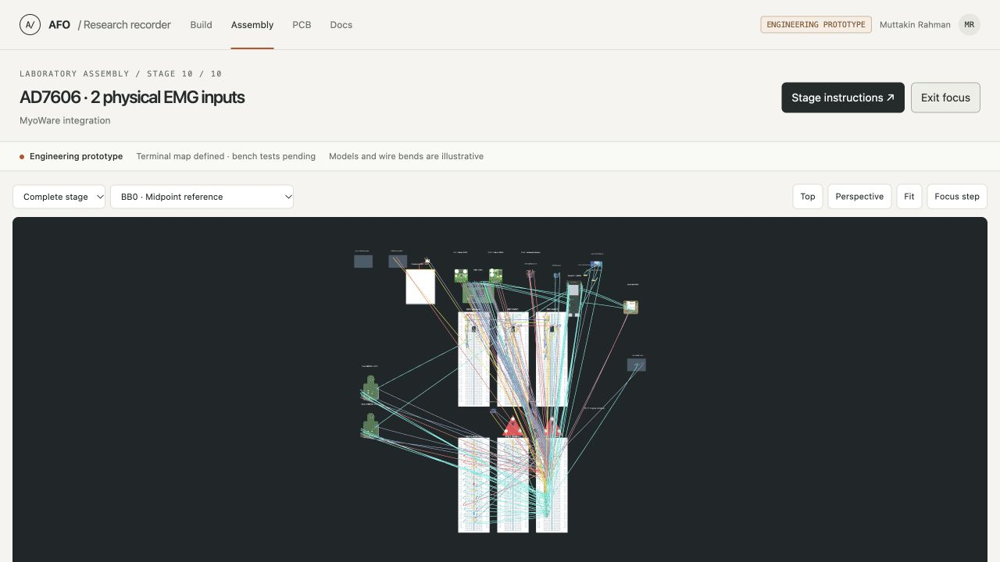
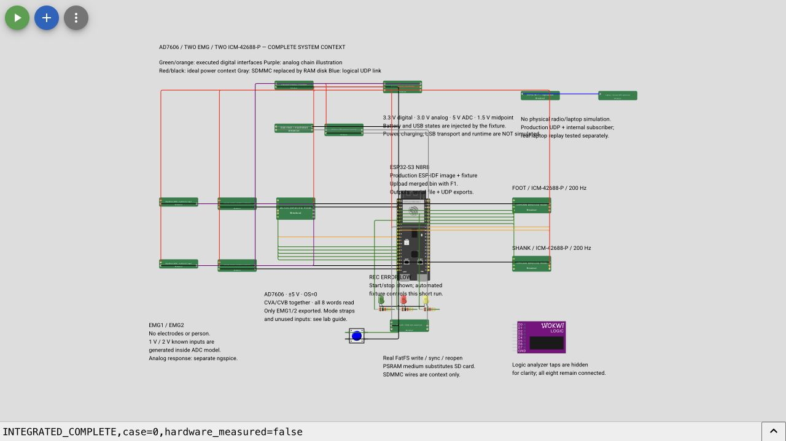

# See the complete recorder

Muttakin Rahman · AD7606 · two MyoWare RAW inputs · two ICM-42688-P sensors

The complete setup has two views: a physical assembly plan for building, and a Wokwi scene for running the recorder software. Both include the controller, power, EMG paths, motion sensors, storage and controls. The earlier Wokwi template link showed a smaller protocol fixture; use the saved project below.

## Open the view you need

| View | Open it | Use it for |
|---|---|---|
| Whole physical assembly | [Open the complete 3D setup](../viewer/index.html?stage=10&v=1.6) | Breadboards, commercial modules, component placement and individual terminal-to-hole connections |
| Complete Wokwi scene | [Open the saved recorder project](https://wokwi.com/projects/476662256690643969) | ESP-IDF execution, modeled ADC/IMU interfaces and visible system context |
| Simulation download | [Download the Wokwi bundle](../simulations/integrated-recorder/full-system/full-system-wokwi.zip) | The exact scene, all custom-chip files, merged firmware and manifests |

### Physical assembly

Select **Stage 10 → Complete stage** to see everything. Use **Focus canvas** to hide the side panels, then **Fit**. Exit focus to inspect connections. Select a wire in the inspector for its exact endpoints; double-click a board to inspect its insertion holes. Module drawings and wire bends remain illustrative.

### Run the Wokwi recorder

1. Open the saved project and extract the Wokwi bundle. The project already includes **36 parts, 79 connections and 24 custom-chip files**.
2. Focus a code editor, press **F1**, and select **Upload Firmware and Start Simulation…**.
3. Select `integrated-recorder/firmware/merged.bin` from the extracted bundle. This is the simulation-only image. The placeholder sketch and default Play button alone do not run the tested recorder.
4. Check the boot output for **ESP-IDF v5.4.2** and **ELF prefix `aabb34031`**. In the simulation menu choose **Full screen**, then **Fit**, so all components are visible.
5. Wait for `INTEGRATED_COMPLETE,case=0`, `EXPORT_END,AFO` and `EXPORT_END,UDP`. The automatic short run uses known 1 V / 2 V ADC codes and both IMU identities.

Re-upload the custom image after reopening the project. Saving the drawing does not guarantee that the uploaded firmware persists. **Never flash this instrumented simulation image onto hardware**; use the separate laboratory firmware profiles for the recorder.

## What the expanded scene passed

The complete scene finished a nominal run with **10,041 EMG frames, 263 foot and 252 shank records**. The saved recording has zero detected sequence gaps, ADC errors, IMU errors or queue drops. The actual converter and live decoder assessed the exported bytes. One preview-frame drop is reported explicitly; the saved file remains complete. IMU host times remain estimates and are marked uncertain.

[Expanded-scene result](../simulations/integrated-recorder/full-system/results/normal/result.json) · [Connection/source checks](../simulations/integrated-recorder/full-system/scene-checks.json) · [Firmware manifest](../simulations/integrated-recorder/firmware/manifest.json)

An additional [input-only pin capture](digital-timing.html) matches all 10,041 conversions and reads to the saved EMG frames, verifies 128 clocks per ADC read, and observes both 200 Hz interrupt streams. Its partial derived waveform and complete-session aggregate counters are supplied separately from the unavailable native full-session VCD download.

The [saved-data guide](data-interpretation.html) now explains the binary format, channel identities, units and estimated timestamps. Its downloadable examples include actual synthetic recordings, CSVs, named analysis tables, quality reports and an independent byte comparison. Both the known-voltage and filtered-waveform captures pass; their measurement records are preserved exactly.

A fresh opening of the saved public project retained every custom model and an exactly matching diagram. Its [repeat nominal run](../simulations/integrated-recorder/full-system/results/saved-project-normal/result.json) also passes with the same saved counts. [Browser persistence checks](../simulations/integrated-recorder/full-system/browser-checks.json).

The [18-case integrated verification report](integrated-verification.html) uses the retained smaller protocol fixture. This additional full-scene run covers the nominal case; it does not relabel the earlier fault-test diagrams as full-scene runs. Recorder firmware and original sensor-model C sources are unchanged.

## Drawn connections and executed interfaces

| Component or path | Execution in Wokwi |
|---|---|
| ESP32-S3, ADC SPI, IMU SPI and interrupts | Actual recorder image with behavioral AD7606 and ICM models |
| MyoWare and buffered two-stage filters | Passive illustrations; known ADC codes originate inside the ADC model. [Analog simulation evidence](circuit-audit.html) is separate. |
| Protected battery, rails, sensing and USB | Passive illustrations; the fixture injects voltage and USB states. No power, charging, USB transport or runtime simulation. |
| microSD and CLK/CMD/D0 wiring | Pin context for the real SDMMC interface. Actual FatFS runs on a PSRAM block medium; the card and SDMMC peripheral are substituted. |
| Wi-Fi and laptop | Actual production UDP reaches an internal subscriber. Radio and external laptop transport are substituted; separate laptop replay tests cover the receiver. |
| LEDs and button | LEDs use the production GPIOs. The automatic fixture starts/stops the short run. |

Green/orange lines show executed sensor interfaces; purple shows the illustrated analog paths. Red/black indicate ideal power context, gray indicates substituted interfaces, and blue marks the logical preview link. Extra model supply/analog ports are drawing terminals, **not RoboticsBD header numbers**.

No virtual run establishes actual module straps, VIO, noise, power startup, card reliability, radio performance or battery runtime. Physical measurements remain pending. Follow the [short laboratory sequence](lab-quickstart.html) when instruments are available; no PCB order is part of these checks.

## Reproduce or inspect

The bundle preserves `integrated-recorder/full-system/` and `integrated-recorder/firmware/`. The scene manifest identifies all diagram/model bytes. [Scene source and reproduction instructions](../simulations/integrated-recorder/full-system/README.md) · [Bundle contents and SHA-256](../simulations/integrated-recorder/full-system/download.json).

The project uses Wokwi's documented [custom firmware upload](https://docs.wokwi.com/guides/esp32), [custom-chip API](https://docs.wokwi.com/chips-api/getting-started) and [diagram format](https://docs.wokwi.com/diagram-format). An official simulator platform does not independently validate project-authored behavioral models.
